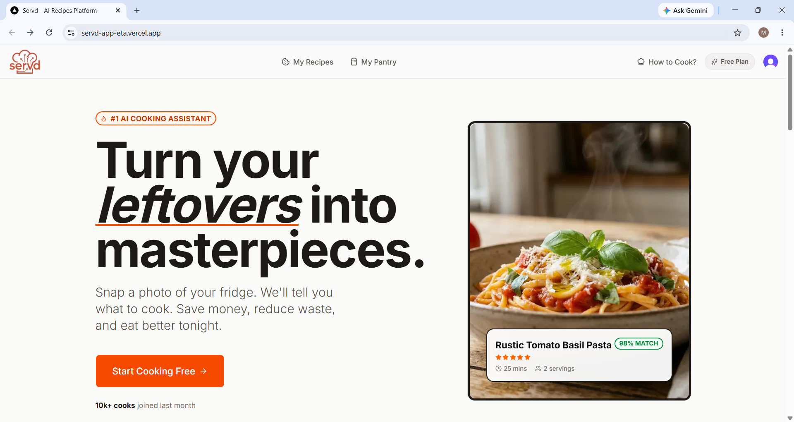
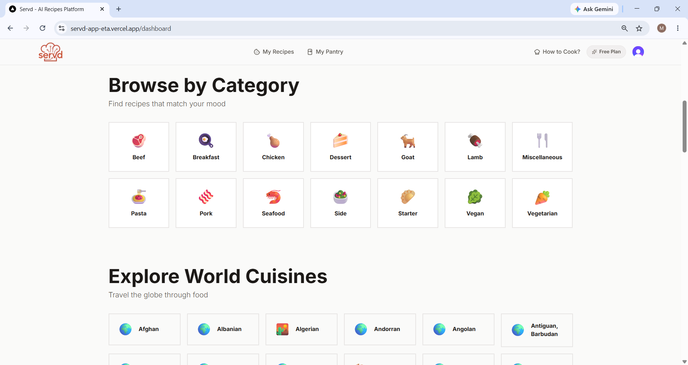
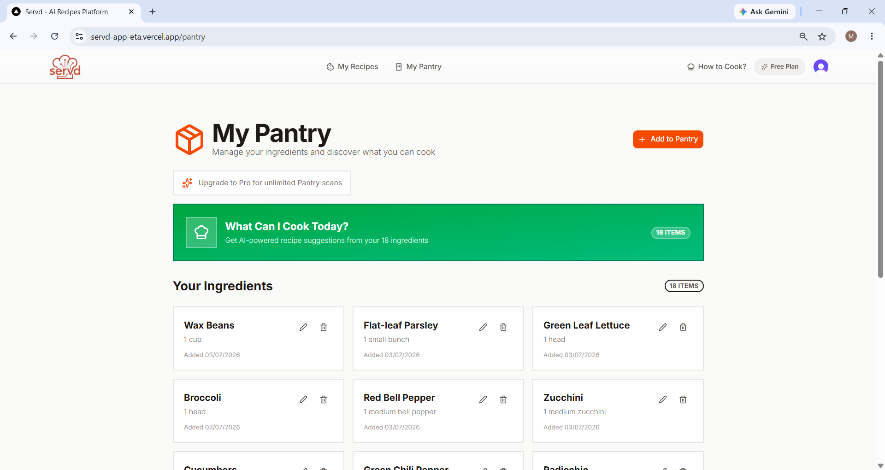
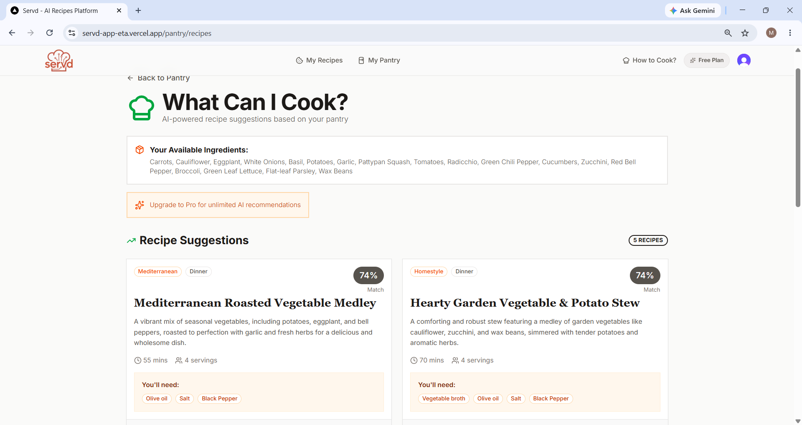
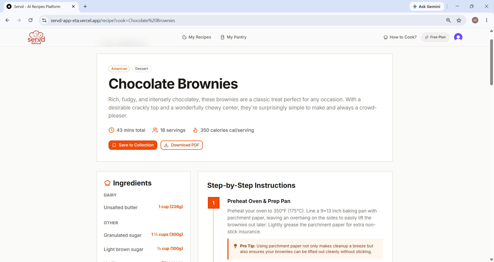
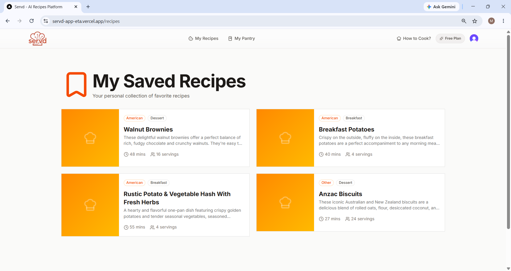
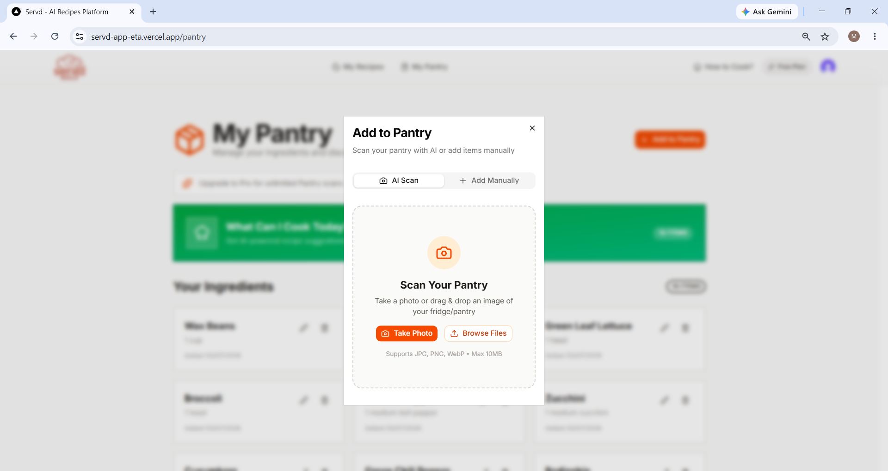
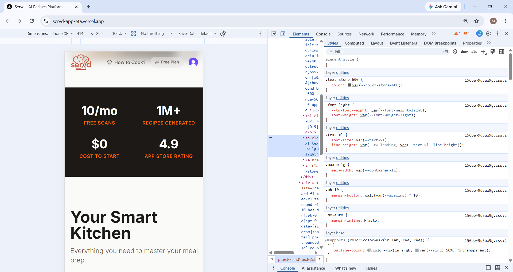

# 🍳 Servd – AI Cooking Assistant

> **Turn your leftovers into masterpieces with AI.**

Servd is a full-stack AI-powered cooking assistant that helps users reduce food waste by turning pantry ingredients into delicious meals. Users can scan their pantry with AI, manage ingredients, receive personalized recipe recommendations, explore thousands of recipes, and save their favorites—all in one modern web application.

---

## 🌐 Live Demo

**Frontend:** https://servd-app-eta.vercel.app

**Backend API:** https://servd-app.onrender.com

---

# 📸 Screenshots

## 🏠 Landing Page

> AI-powered cooking assistant landing page



---

## 🍽 Recipe Dashboard

> Browse thousands of recipes by cuisine and category



---

## 🥕 Pantry Management

> Manage your pantry ingredients manually or with AI



---

## 🤖 AI Pantry Recommendations

> Generate recipes using ingredients already available in your pantry



---

## 👨‍🍳 AI Recipe Generation

> AI-generated recipe with cooking instructions, nutrition, tips and substitutions



---

## ❤️ Saved Recipes

> Personal cookbook for your favorite recipes



---

## 📷 AI Pantry Scanner

> Upload a pantry image and automatically detect ingredients



---

## 📱 Responsive Design

> Fully responsive experience across desktop, tablet and mobile



---

# ✨ Features

### 🤖 AI Recipe Generation

- Generate complete recipes using Google Gemini AI
- Step-by-step cooking instructions
- Nutritional information
- Ingredient substitutions
- Chef tips and cooking suggestions

### 🥬 AI Pantry Management

- AI-powered pantry scanning
- Manual ingredient management
- Pantry inventory tracking
- Automatic ingredient detection

### 🍽 Smart Meal Recommendations

- Personalized recipes based on pantry ingredients
- Ingredient match percentage
- Missing ingredient suggestions
- Reduce food waste

### 🌍 Explore Recipes

- Browse thousands of recipes
- Search recipes instantly
- Explore global cuisines
- Browse by categories
- Recipe of the Day

### ❤️ Personal Cookbook

- Save favorite recipes
- Personal recipe collection
- Quick access to saved meals

### 🔐 Authentication

- Secure Clerk Authentication
- User-specific pantry
- Personalized saved recipes

### ☁ Cloud Deployment

- Frontend deployed on **Vercel**
- Backend deployed on **Render**
- Database hosted on **Neon PostgreSQL**

---

# 🛠 Tech Stack

## Frontend

- Next.js 16
- React 19
- Tailwind CSS
- Shadcn UI
- Clerk Authentication
- Server Actions

## Backend

- Strapi CMS
- PostgreSQL
- Neon Database
- REST API

## Artificial Intelligence

- Google Gemini AI
- AI Recipe Generation
- Pantry Ingredient Recognition

## Security

- Arcjet
- Rate Limiting
- Bot Protection

## Deployment

- Vercel
- Render
- Neon PostgreSQL

---

# 🏗 System Architecture

```text
                  User
                    │
                    ▼
          Next.js Frontend (React)
                    │
        Clerk Authentication
                    │
                    ▼
        Next.js Server Actions
                    │
                    ▼
          Strapi REST API
                    │
                    ▼
          Neon PostgreSQL Database
                    │
                    ▼
            Google Gemini AI
```

---

# 🚀 Installation

Clone the repository

```bash
git clone https://github.com/mahimakathpal/Servd-App.git
```

Go into the project

```bash
cd Servd-App
```

### Backend

```bash
cd backend
npm install
npm run develop
```

### Frontend

```bash
cd frontend
npm install
npm run dev
```

---

# 🔑 Environment Variables

## Frontend

```env
NEXT_PUBLIC_STRAPI_URL=

NEXT_PUBLIC_CLERK_PUBLISHABLE_KEY=

CLERK_SECRET_KEY=

GEMINI_API_KEY=

ARCJET_KEY=

STRAPI_API_TOKEN=
```

## Backend

```env
DATABASE_URL=

DATABASE_CLIENT=postgres

APP_KEYS=

API_TOKEN_SALT=

ADMIN_JWT_SECRET=

TRANSFER_TOKEN_SALT=

JWT_SECRET=

ENCRYPTION_KEY=
```

---

# 💡 Future Improvements

- OCR ingredient detection
- Barcode scanner
- Grocery list generation
- Weekly meal planner
- Nutrition dashboard
- Social recipe sharing
- Recipe ratings & comments
- Stripe subscription integration
- Shopping list synchronization
- Meal calendar

---

# 👩‍💻 Author

**Mahima Kathpal**

- GitHub: https://github.com/mahimakathpal
- LinkedIn: *(Add your LinkedIn URL here)*

---

# ⭐ If you like this project

Give this repository a ⭐ on GitHub if you found it useful!
